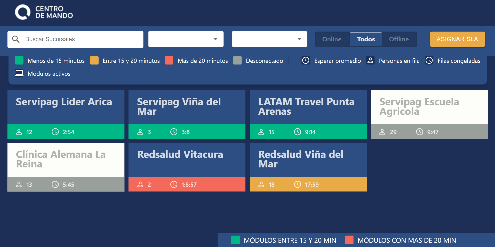
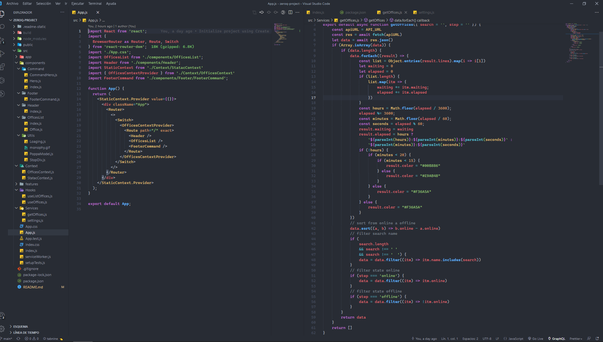
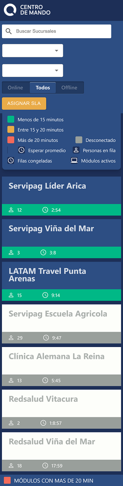

# Zeroq Project FrondEnd

## tecnologías de desarrollo
- React
- Styled-components
- Redux
- Custom hooks
- Material ui
- Material icons

[Ver la app en produccion](https://zeroq.netlify.app/)

# Frontend
git clone.

- `npm install` para instalar las dependencias
- `npm start` para entorno de desarrollo
- `npm run build` compilador build

## Redes sociales Jehingson Pernia
## Youtube
- youtube 
  [ver canal de youtube Json dev](https://www.youtube.com/channel/UC93nu9iAZlqtUkFbky9bUQQ)
- Linkedin.com 
  [ver Linkendin.com](https://www.linkedin.com/in/jehingson-pernia-0b3984204/)

## Licencia
MIT

# Aqutectura

- App.js inicializa el proyecto
- Creamos un state global a traves en context/OfficesContext.js
- getOffices el unicon endpoind a usar he iterar en Services/getOffices.js
- Filtra por nombre y por stop offline y online
- Cambio de  estado de la oficina alternando entre offline, online y todos
  

# Diseño response

# TEMAS RELACIONADO DE MI AUTORÍA
- [clone de MercadoLibre](https://www.youtube.com/watch?v=U5qGUF62kmc&t=182s)
- [clone de Linkendin](https://www.youtube.com/watch?v=N6QnD9O0aFQ&t=1419s)
- [clone de Tweeter](https://www.youtube.com/watch?v=ZNUrVPLbCfw)